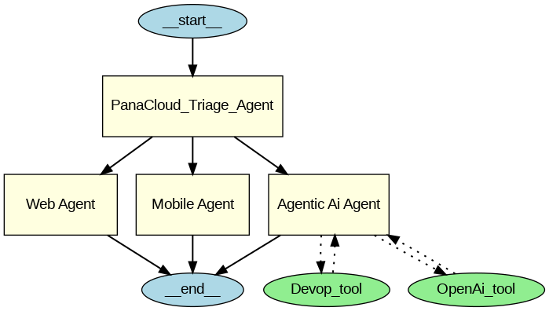

# Explanation Of Code

## 🧠 What Is This Code Doing?
This code builds a **smart assistant system** using **Google Gemini API** and **OpenAI Agents SDK**. It can:

 * Answer questions

 * Hand over (delegate) the question to the most expert assistant (called **handoff**)

 * Show how different assistant agents are connected using a visual graph

## 🔧 Step 1: Install the required tools

        !pip install -q openai-agents

📦 This installs the software (Agents SDK) you need to create smart assistant agents.

## 🔁 Step 2: Fix a known error with Google Colab

        import nest_asyncio
        nest_asyncio.apply()

🔄 Fixes an issue that happens when running things repeatedly in Colab's background loop.

## 🔑 Step 3: Setup Gemini API key and connect the model

        from google.colab import userdata
        gemini_api_key = userdata.get('GEMINI_API_KEY')

🔐 Gets your Gemini API key from a secure place so the assistant can talk to Gemini (Google’s powerful language model).

## 🤖 Step 4: Create your first assistant

        agent: Agent = Agent(name="Assistant", instructions="You are a helpful assistant", model=model)
        result = Runner.run_sync(agent, "Hello, how are you.")

🗣️ You are creating a friendly chatbot called Assistant. You then ask it a question: "Hello, how are you?", and it responds.

🧩 Step 5: Create more specialized agents

        web_agent, mobile_agent, dev_Ops_agent, openai_agent, agentic_ai_agent

👩‍💻 These are experts for specific topics:

* **Web Agent** – knows only web development

* **Mobile Agent** – knows only mobile development

* **DevOps Agent** – knows only DevOps stuff

* **OpenAI Agent** – knows only about OpenAI

* **Agentic AI Agent** – can use DevOps and OpenAI agents as tools when needed

These agents only answer questions in their subject.

## 🔀 Step 6: Create the main manager agent

        panaCloud_agent

🧠 This agent is called PanaCloud_Triage_Agent. Its job is to listen to the question and decide:

 “Should I answer this myself, or hand it over to one of my expert agents?”

For example, if the question is about mobile apps, it hands it off to the Mobile Agent.

## 🔍 Step 7: Enable Debug/Verbose Mode

            from agents import enable_verbose_stdout_logging
            enable_verbose_stdout_logging()

🕵️ Turns on detailed logging — so you can see everything that happens step by step inside the assistant’s brain.

## 🧪 Step 8: Run the system

        result = Runner.run_sync(panaCloud_agent, "tell me about web developer.")

🤔 Ask a question to the main manager. Here, the question is:

 “Tell me about web developer.”

This question gets handed off to the Web Agent — because it’s about web development.

## 📊 Step 9: Show a visual graph

            from agents.extensions.visualization import draw_graph
            draw_graph(panaCloud_agent)

📈 This shows a diagram of how all the agents are connected — like a family tree of your assistant agents.

# Collab Link
[Open in Google Colab](https://colab.research.google.com/drive/1NLzKg9Y14JgSKEFV2PwHLVYWIuceF9xe?usp=sharing)
